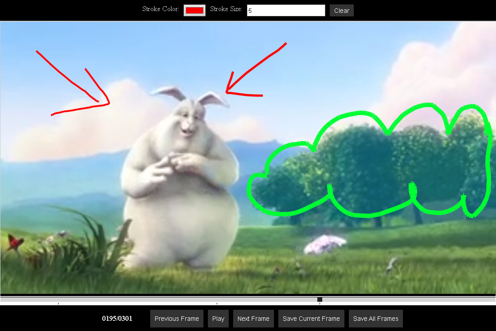

<h1 align="center">Web Media Annotator</h1>

<p align="center">
    <!-- Placeholder for screenshot -->
    <!--  -->
</p>

A powerful, web-based tool for annotating video and image media with frame-accurate precision. Built with a modular architecture that separates core annotation logic from the UI, enabling easy integration into any web application.

## 🎯 Project Goal

The ultimate goal is to create a professional-grade, browser-based media annotation suite capable of:
- **Frame-Accurate Annotation**: Drawing on specific video frames with vector precision.
- **Temporal Annotations**: defining start and end times for annotations (e.g., "follow this object for 5 seconds").
- **Rich Media Support**: Handling video playback, audio scrubbing, and potentially multi-track syncing.
- **Export Flexibility**: Exporting data in standard formats (JSON) or "burning in" annotations for review.
- **Extensibility**: Allowing developers to add custom tools and rendering logic via plugins.

## ✅ Implemented Features

### 🎨 Annotation Tools
- **Vector Shapes**: Draw Squares, Circles, Arrows, and Freehand lines.
- **Text Support**: Add text labels directly onto frames.
- **Selection & Editing**: Select, move, and modify existing annotations.
- **Undo/Redo**: Robust history support for all actions.
- **Color Picking**: EyeDropper tool to sample colors from the video.

### 🎥 Playback & Navigation
- **Frame-Accurate Scrubbing**: Navigate video frame-by-frame.
- **Pan & Zoom**:
    - **Smooth Interaction**: Pan (Hand tool) and Zoom (Scroll wheel) with inertia.
    - **Fit-to-Content**: Canvas automatically aligns to the video content, ignoring letterboxing/black bars.
    - **Pixel-Perfect Sync**: Annotations stay locked to video details at any zoom level using CSS transforms.
- **Ghosting (Onion Skinning)**:
    - View previous (red) and future (green) frames overlaid on the current frame.
    - Configurable range (1-10 frames) and opacity.
- **Audio**:
    - Synchronized audio playback.
    - Volume control and Mute toggle.

### 💾 Import & Export
- **Export to Image**: Download the current frame with all annotations "burned in" as a high-quality PNG.
- **State Management**: Centralized store with complete state persistence.

## 🚧 Roadmap (Pending)

### ⏳ Annotation Duration (Hold)
- **Goal**: Allow an annotation to persist for a specific duration or range of frames.
- **Planned UI**: "Hold" input field in the toolbar (e.g., "Hold for 5 frames" or "Until Frame X").
- **Logic**: Update Renderer to check frame ranges instead of single-frame strict equality.

### 🎵 Audio Visuals
- **Goal**: Visualize the audio waveform in the timeline.

### 📦 Advanced Export
- **Goal**: Export annotation data as a standardized JSON format.
- **Utility**: Allowing re-importing of sessions or integration with backend systems (ML training pipelines, review tools).

### 🛠 Plugins & API
- **Goal**: Finalize the Plugin API.
- **Utility**: Allow third-party developers to create custom tools (e.g., "marching ants" selection, AI-assisted segmentation) without forking the core.

## 🏗 Architecture

The project is structured as a Monorepo:

- **`packages/core`**: The headless library containing the state management (`Store`), rendering engine (`Renderer`), and tool logic (`PanTool`, `FreehandTool`, etc.). It has no UI dependencies other than a container element.
- **`apps/demo`**: A reference implementation using purely Vanilla TypeScript/CSS to demonstrate how to build a UI around the core library.

## 🌟 Versatile Usage Modes

This project is designed to be used in three distinct ways depending on your needs:

1.  **Static Web App (Quick Reviews)**
    -   Use as a standalone tool running completely in the browser.
    -   Upload local video/image files which are processed in-memory (no server upload required).
    -   Ideal for quick, secure reviews of daily work.

2.  **CDN Integration (Static Files)**
    -   Load the library via a `script` tag from a CDN (or locally hosted static files).
    -   Easily embed an annotation widget into legacy apps or static sites using vanilla HTML/JS/CSS.

3.  **NPM Module (Build Integration)**
    -   Import `@web-media-annotator/core` into complex React/Vue/Angular applications.
    -   Leverage the full TypeScript API for deep integration and custom UI development.

## 🚀 Getting Started

### Prerequisites
- Node.js (v16+)
- NPM

### Installation

1.  Clone the repository:
    ```bash
    git clone https://github.com/hasielhassan/WebMediaAnnotator.git
    cd WebMediaAnnotator
    ```

2.  Install dependencies:
    ```bash
    npm install
    ```

3.  Build the core package:
    ```bash
    npm run build -w @web-media-annotator/core
    ```

4.  Run the Demo:
    ```bash
    npm run dev:demo
    ```
    Open your browser to the URL shown (usually `http://localhost:5173` or similar).

## 🤝 Contributing

Contributions are welcome! Please focus on the `packages/core` for functional improvements and `apps/demo` for UI enhancements.

## 📄 License

MIT
